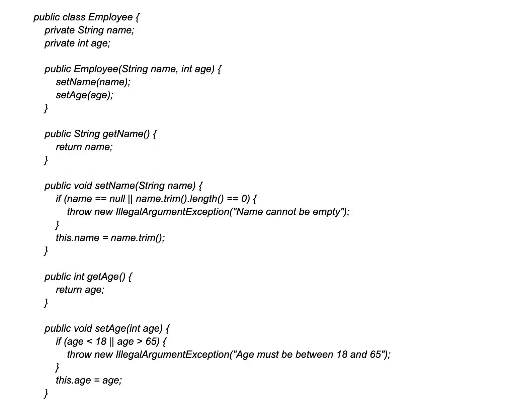

[DOC links](https://github.com/DopplerHQ/awesome-interview-questions)


# Common Questions

## Tell me something about yourself
My name is Jay Prakash Sonkar, and I am a software developer with over four years of experience. I have built numerous applications and possess a solid understanding of the end-to-end development process. I greatly enjoy building applications, some of which are utilized by multiple users, such as a web IDE and proxy servers.
- `WEB IDE`: Enables user to write execute and share code with anyone.
- `Proxy Server`: is a pre-ready server, which helps developers to develop anything efficiently and smoothly.


# Python Programming

## Syntax and Basics

### Variables and Data Types

```python
# Variables
name = "John"
age = 25
is_student = False

# Common Data Types
integer_number = 42
float_number = 3.14
text = "Hello, World!"
list_example = [1, 2, 3]
dictionary_example = {"key": "value"}
```

### Operators and Expressions

```python
# Arithmetic Operators
result = 10 + 5
remainder = 10 % 3

# Comparison Operators
is_equal = (5 == 5)
not_equal = (5 != 3)

# Logical Operators
logical_and = (True and False)
logical_or = (True or False)

# Expressions
expression_result = (2 * (3 + 4)) / 2
```

## Advanced Python

### List Comprehensions
```python
squares = [x**2 for x in range(10)]
```

### Generators
```python
generator_example = (x for x in range(10))

# Access values using next()
first_value = next(generator_example)
second_value = next(generator_example)

print("First Value:", first_value)
print("Second Value:", second_value)
```

### Decorators
```python
def wrapper(func,*args,**kwargs):
    def inner(*args, **kwargs):
        print("before function call")
        return_values = func(*args,**kwargs)
        print("after function call")
        return return_values
    return inner

@wrapper
def myfun(a,b,c):
    print("printing ",a,b,c)
    return a+b,b+c

myfun(a=1,b=2,c=3)
```

#### Passing arguments to wrapper
```python
def wrapper(*wrapper_args):
    def decorator(func):
        def inner(*args, **kwargs):
            print("before function call")
            print("Values passed to wrapper:", wrapper_args)
            return_values = func(*args, **kwargs)
            print("after function call")
            return return_values
        return inner
    return decorator

@wrapper(23, 45)
def myfun(a, b, c):
    print("printing ", a, b, c)
    return a + b, b + c

myfun(a=1, b=2, c=3)
```


### Exception Handling
```python
try:
    result = 10 / 0
except ZeroDivisionError:
    result = "Cannot divide by zero"
```

### Context Managers
```python
with open("example.txt", "r") as file:
    content = file.read()
```

### Closures Functions
```python
def outer_function(x):
    def inner_function(y):
        return x + y
    return inner_function

closure_example = outer_function(10)
closure_result = closure_example(5)
print(closure_result)
closure_result = closure_example(closure_result)
print(closure_result)
```

### Lambda Functions 
```python
square = lambda x: x**2
```

### Concurrency and Parallelism [No IDEA]
```python
import concurrent.futures

# Concurrency with Threads
def print_numbers():
    for i in range(5):
        print(i)

with concurrent.futures.ThreadPoolExecutor() as executor:
    executor.submit(print_numbers)

# Parallelism with Processes
with concurrent.futures.ProcessPoolExecutor() as executor:
    executor.submit(print_numbers)
```

# Backend Development

## API Development

### RESTful Principles:
- **REST (Representational State Transfer)** is an architectural style for designing networked applications.
- Key principles include stateless communication, resource identification, and uniform interfaces.

### CRUD Operations:
- CRUD stands for Create, Read, Update, and Delete, representing the basic operations for persistent storage.
- [PrepDoc](https://github.com/iamjpsonkar/CRUD_Learnings/blob/main/README.md)
###  Authentication and Authorization:
- Authentication ensures that a user is who they claim to be.
- Authorization determines the level of access a user has.
- [Authentication and Authorization Document](https://github.com/iamjpsonkar/CRUD_Learnings/blob/main/README.md#authentication-and-authorization)

## Optimization Techniques

### Database Indexing:
- Indexes improve the speed of data retrieval operations on a database table.
- Common types include B-tree, hash, and full-text indexes.
### Caching Strategies:
- Caching involves storing copies of files or data in a location to serve future requests faster.
- Techniques include in-memory caching, CDN caching, and browser caching.
### Load Balancing:
- Load balancing distributes incoming network traffic across multiple servers to ensure no single server is overwhelmed.

## Transaction Management

### ACID Properties:
- ACID stands for Atomicity, Consistency, Isolation, and Durability, ensuring reliable database transactions.
### Isolation Levels:
- Isolation levels define the degree to which one transaction must be isolated from the effects of others.

## Security Best Practices
### Input Validation:
- Validate and sanitize user input to prevent security vulnerabilities.
### XSS and CSRF Prevention:
- Cross-Site Scripting (XSS) and Cross-Site Request Forgery (CSRF) are common web application security vulnerabilities.

# Web Frameworks

## Flask

### Routing and Views
*Routing is the process of mapping URLs to functions in your Flask application. Views are the functions that handle the requests and generate responses.*

```python
from flask import Flask

app = Flask(__name__)

# Define a route
@app.route('/')
def home():
    return 'Hello, this is the home page!'

# Another route
@app.route('/about')
def about():
    return 'This is the about page.'

if __name__ == '__main__':
    app.run(debug=True)
```

### Templates and Forms
*Templates allow you to render dynamic content, and forms help manage user input.*
```python
from flask import Flask, render_template, request

app = Flask(__name__)

# Render HTML template
@app.route('/')
def home():
    return render_template('home.html')

# Handle form submission
@app.route('/submit', methods=['POST'])
def submit():
    if request.method == 'POST':
        username = request.form.get('username')
        return f'Hello, {username}!'

if __name__ == '__main__':
    app.run(debug=True)
```


### Flask Extensions
*Flask extensions enhance the functionality of your application. Here's an example using Flask-WTF for form handling.*

```python
from flask import Flask, render_template
from flask_wtf import FlaskForm
from wtforms import StringField, SubmitField

app = Flask(__name__)
app.config['SECRET_KEY'] = 'your_secret_key'

# Define a form using Flask-WTF
class MyForm(FlaskForm):
    username = StringField('Username')
    submit = SubmitField('Submit')

# Route using the form
@app.route('/form', methods=['GET', 'POST'])
def form():
    form = MyForm()
    if form.validate_on_submit():
        username = form.username.data
        return f'Form submitted with username: {username}'
    return render_template('form.html', form=form)

if __name__ == '__main__':
    app.run(debug=True)
```

`pip install Flask Flask-WTF`

## Django
[Django](https://github.com/iamjpsonkar/Django_learnings/blob/main/README.md)

## Sanic
### **Not Covering in Deep**

### Asynchronous Request Handlers
*Sanic supports asynchronous request handlers, allowing you to write non-blocking, asynchronous code for improved performance.*

```python
from sanic import Sanic
from sanic.response import text

app = Sanic()

# Asynchronous request handler
@app.route('/')
async def home(request):
    return text('Hello, this is the home page!')

if __name__ == '__main__':
    app.run(host='0.0.0.0', port=8000, debug=True, workers=4)
```

### Middleware
*Middleware in Sanic allows you to process requests globally, providing a way to modify or handle requests before they reach the route handler.*

```python
from sanic import Sanic
from sanic.response import text

app = Sanic()

# Middleware example
async def custom_middleware(request):
    print("This is executed for every request before reaching the route handler.")
    return await request.next()

app.register_middleware(custom_middleware)

# Route handler
@app.route('/')
async def home(request):
    return text('Hello, this is the home page!')

if __name__ == '__main__':
    app.run(host='0.0.0.0', port=8000, debug=True, workers=4)
```

### Blueprints
*Blueprints in Sanic help modularize your application by grouping related routes.*

```python
from sanic import Sanic
from sanic import Blueprint
from sanic.response import text

app = Sanic()

# Create a blueprint
bp = Blueprint('my_blueprint')

# Route within the blueprint
@bp.route('/blueprint')
async def blueprint_handler(request):
    return text('This is a route in the blueprint.')

# Register the blueprint with the app
app.blueprint(bp)

if __name__ == '__main__':
    app.run(host='0.0.0.0', port=8000, debug=True, workers=4)
```

# Database Management

## SQL Databases
### SQL Queries, Joins, Aggregations:
- SQL queries retrieve and manipulate data, join and combine data from multiple tables, and aggregate data.
### Indexing and Optimization:
- Indexing involves creating indexes for faster query execution, and optimization ensures efficient database performance.

## NoSQL Databases
### Overview of MongoDB, Redis, etc.:
- NoSQL databases like MongoDB and Redis offer alternatives to traditional relational databases.

### MongoDB
*MongoDB is a NoSQL database that stores data in a flexible, JSON-like format known as BSON (Binary JSON). It is designed to handle large amounts of unstructured or semi-structured data. MongoDB is classified as a document-oriented database, part of the NoSQL family, and is often used in web development as a backend database for applications.*

#### Key Concepts
- **Document**: A document is a basic unit of data in MongoDB, and it is a set of key-value pairs. Documents are similar to JSON objects and can contain arrays and other documents.
    ```js
    {
        "_id": ObjectId("5fd7a7c2b4ae240d08f00b5a"),
        "name": "John Doe",
        "age": 30,
        "email": "john.doe@example.com",
        "address": {
            "city": "New York",
            "state": "NY",
            "country": "USA"
        }
    }
    ```

- **Collection**: A collection is a grouping of MongoDB documents. It is equivalent to an RDBMS table. Collections don't enforce a schema, meaning documents within a collection can have different fields.

- **Database**: MongoDB stores collections in databases. A single MongoDB server can host multiple databases, each with its own set of collections.

#### Basic MongoDB Queries

- Insert a Document
```js
db.users.insertOne({
    "name": "Jane Doe",
    "age": 25,
    "email": "jane.doe@example.com",
    "address": {
        "city": "Los Angeles",
        "state": "CA",
        "country": "USA"
    }
})
```

- Find Documents
```js
// Find all documents in the 'users' collection
db.users.find()

// Find documents with a specific condition
db.users.find({"age": {"$gt": 25}})
```

- Update Document
```js
// Update a document
db.users.updateOne(
    {"name": "John Doe"},
    {"$set": {"age": 31}}
)
```

- Delete Document
```js
// Delete a document
db.users.deleteOne({"name": "Jane Doe"})
```

- Aggregation
```js
// Aggregate data (e.g., group by and calculate average)
db.users.aggregate([
    {"$group": {"_id": "$address.city", "average_age": {"$avg": "$age"}}}
])
```

#### PyMongo
```python
from pymongo import MongoClient

# Connect to MongoDB
client = MongoClient("mongodb://localhost:27017/")  # Update with your MongoDB connection string
database_name = "example_db"
collection_name = "users"

db = client[database_name]
collection = db[collection_name]

# Create Index (optional)
collection.create_index("email", unique=True)

# Insert Documents
data_to_insert = [
    {
        "name": "John Doe",
        "age": 30,
        "email": "john.doe@example.com",
        "address": {
            "city": "New York",
            "state": "NY",
            "country": "USA"
        }
    },
    {
        "name": "Jane Doe",
        "age": 25,
        "email": "jane.doe@example.com",
        "address": {
            "city": "Los Angeles",
            "state": "CA",
            "country": "USA"
        }
    }
]

# Insert multiple documents
collection.insert_many(data_to_insert)

# Find Documents
all_users = collection.find()

for user in all_users:
    print(user)

# Query with a condition
specific_users = collection.find({"age": {"$gt": 25}})
print("\nUsers older than 25:")
for user in specific_users:
    print(user)

# Update Document
collection.update_one({"name": "John Doe"}, {"$set": {"age": 31}})

# Delete Document
collection.delete_one({"name": "Jane Doe"})

# Close MongoDB Connection
client.close()
```

## Database Design
### Normalization and Denormalization:
- Normalization organizes data to reduce redundancy, while denormalization simplifies data retrieval.
### Entity-Relationship Diagrams (ERD):
- ERDs visualize the relationships between entities in a database.

# DevOps and Tools

## Git

### Concepts

- **Branching, Merging, Resolving Conflicts:**
  - Git allows branching for parallel development.
  - Merging integrates changes.
  - Conflict resolution manages conflicting changes.

- **Gitflow Workflow:**
  - Gitflow is a branching model that defines a strict branching strategy.

### Content for Revision

- Practice creating branches, merging branches, and resolving conflicts in Git.
- Understand the Gitflow workflow for collaborative development.

## Bash Scripting

### Concepts

- **Basic Commands:**
  - Basic Linux commands for navigation, file manipulation, and system interaction.

- **Scripting for Automation:**
  - Writing Bash scripts to automate repetitive tasks.

### Content for Revision

- Review basic Linux commands (cd, ls, cp, mv, rm, mkdir, etc.).
- Practice writing Bash scripts for automating tasks.

## Linux

### Concepts

- **File System Structure:**
  - Understanding the Linux file system hierarchy.

- **Process Management:**
  - Basic process management commands like ps, kill, top.


## Docker

### Concepts

- **Containerization Concepts:**
  - Docker containers encapsulate applications and their dependencies for consistency across different environments.

- **Docker Compose:**
  - Docker Compose simplifies multi-container application management.

# Frontend Development
## Web Development Basics
[Web Development](https://github.com/iamjpsonkar/WebLearnings/blob/main/README.md)
### HTML, CSS, JavaScript
- HTML structures web content, CSS styles it and JavaScript adds interactivity.
### Responsive Design
- Designing websites to be accessible and functional on various devices.


## Node.js
[Node Learnings](https://github.com/iamjpsonkar/Nodejs_Learnings/blob/master/README.md)
### Server-Side JavaScript
- Node.js enables JavaScript to run on the server.
### npm (Node Package Manager)
- npm manages JavaScript packages and dependencies.

### Content for Revision
- Understand the basics of server-side JavaScript with Node.js.
- Explore npm commands for package management.

# AI/ML Development
[AI/ML Development](https://github.com/iamjpsonkar/ML_Learnings/blob/master/README.md)

## Machine Learning Concepts

### Supervised and Unsupervised Learning
- Supervised learning uses labeled data, unsupervised learning works with unlabeled data.

### Regression, Classification, Clustering
- Different types of machine learning tasks.

## Data Science Basics

### Data Cleaning, Exploration, Visualization
- Preparing and exploring data before analysis.

### Statistical Concepts
- Understanding statistical measures and distributions.

## Python for AI/ML

### Libraries (NumPy, Pandas, Matplotlib, Scikit-learn)
- Essential Python libraries for AI/ML tasks.

### Jupyter Notebooks
- Interactive computing for data analysis.

# Data Structures and Algorithms
[String Algorithms](https://github.com/iamjpsonkar/Algorithm_learnings/blob/main/README.md)
[Data Structure and Algorithms](https://github.com/iamjpsonkar/DS_ALGO/blob/main/README.md)

# System Design
[System Design](https://github.com/iamjpsonkar/SystemDesign_Learnings/blob/master/README.md)


# Full Stack Developer Questions

## <a href="https://www.turing.com/interview-questions/senior-full-stack">www.turing.com</a>

## **Difference Between Responsive and Adaptive Design**

### 1. **Responsive Design**
- **Definition**: Responsive design is an approach to web design where the layout adjusts fluidly across various screen sizes and devices, using flexible grids, layouts, and media queries.
- **How it Works**: The design responds to the size of the browser window by scaling elements dynamically, allowing the content to fit any screen size (e.g., desktop, tablet, mobile).
- **Technology**: Primarily uses CSS media queries, percentages, and flexible grids to adjust elements based on viewport size.
- **Frameworks**:
  - **Bootstrap**: A popular CSS framework with a responsive grid system and components that adapt to screen sizes.
  - **Foundation**: A flexible front-end framework that includes a responsive grid and UI elements.
  - **Tailwind CSS**: A utility-first CSS framework that allows for responsive design using predefined classes and breakpoints.
- **Pros**:
  - Seamless experience across all devices.
  - Easier to maintain with a single codebase.
  - Smooth transitions between different screen sizes.
- **Cons**:
  - Can be slower to load as the browser has to adjust layouts on-the-fly.
  - Complex designs may become difficult to manage on smaller screens.

### 2. **Adaptive Design**
- **Definition**: Adaptive design is an approach where the website has multiple fixed layouts designed for specific screen sizes. When a user visits, the most appropriate layout is selected based on the device or viewport.
- **How it Works**: The site detects the device and loads the pre-designed layout specific to that screen size (e.g., desktop, tablet, mobile), without scaling between screen sizes.
- **Technology**: Relies on CSS, JavaScript, and server-side detection to load different layouts based on specific breakpoints.
- **Frameworks**:
  - **ZURB Foundation for Apps**: A framework designed to create adaptive web applications with predefined breakpoints for multiple devices.
  - **jQuery Mobile**: A touch-optimized framework focusing on adaptive layouts for mobile and tablet devices.
  - **Sencha Touch**: A framework for building cross-platform mobile web applications with adaptive layouts for specific devices.
- **Pros**:
  - Optimized performance as each layout is tailored to a specific device.
  - Better control over design elements at each specific breakpoint.
- **Cons**:
  - Requires maintaining multiple layouts, increasing development complexity.
  - Less fluidity between screen sizes; might miss some intermediate screen sizes.

### 3. **Key Differences**
| Aspect               | Responsive Design                          | Adaptive Design                           |
|----------------------|--------------------------------------------|-------------------------------------------|
| **Layout**           | Fluid and adjusts dynamically              | Fixed layouts for specific screen sizes   |
| **Device Detection**  | No specific detection; uses CSS media queries | Detects device or viewport to load layout |
| **Flexibility**       | Highly flexible across all devices         | Limited to predefined breakpoints         |
| **Maintenance**       | Easier to maintain with one codebase       | More difficult, requires multiple layouts |
| **Performance**       | May require more processing for adjustments | Optimized for each device, faster load    |

### 4. **Which to Choose?**
- **Responsive Design** is ideal when you want a fluid experience across all devices with less development effort.
- **Adaptive Design** is preferred when performance is critical and you need precise control over the design for each specific device type.


## **What do you mean by data attributes?**

A **data attribute** is a data field that defines the characteristics or features of a **data object**. It serves as descriptive information about the data itself, essentially providing **metadata** that explains or categorizes the main data in a structured way.

### **Understanding Data Attributes**

- **Defining Characteristics**: Data attributes describe specific properties or qualities of a data object. For example, in a table of employees, data attributes could be "Name," "Age," "Department," or "Employee ID."
- **Relational Database Format**: Data attributes typically exist in **table format** in databases, where rows represent individual data objects (like a person or product), and columns represent attributes of those objects.
  
  Example:
  ```plaintext
  | Employee ID | Name      | Age | Department |
  |-------------|-----------|-----|------------|
  | 001         | John Doe  | 30  | HR         |
  | 002         | Jane Smith| 28  | IT         |




## What is a web server?

A web server is a computer that stores, processes, and delivers website content to browsers. When a user makes a request to the browser, it responds to the requests using HTTP and other protocols.

A web server is a combination of hardware and software. The hardware allows the exchange of data to the devices that make a request, while the software controls how the user can access the stored files.

## Why is RESTful API a popular choice in web development?

REST stands for Representational State Transfer. It's a software architecture that provides guidelines for how to build web APIs and systems that can communicate with each other

RESTful API is a popular choice in web development due to its several beneficial features and design principles that enhance the efficiency and maintainability of web services. Some of these features include Stateless, Scalable and performant, Cacheable, among others.

RESTful API is designed to be stateless, meaning each request sent from the client to the server must contain all necessary information for the server to process it. This prevents the server from having to maintain client state between requests, which simplifies the server's architecture and enhances scalability.

The stateless nature of RESTful API allows for better load balancing, horizontal scaling, and improved performance, as servers can more easily distribute the workload without the need to coordinate client states.


## What is the MVC Design Pattern?

The **Model-View-Controller (MVC)** design pattern is a popular architectural pattern in software and web development. It is used to organize code in a way that separates the application into three distinct components, each with a specific role. This separation helps to structure complex applications, improve maintainability, and promote scalability.

### 1. **Model**
- **Definition**: The Model represents the **data** and the **business logic** of the application. It is responsible for:
  - Managing the data (e.g., storing, retrieving, updating).
  - Performing business logic or calculations.
  - Responding to requests from the Controller to either return data or modify the data based on user actions.
- **Examples**:
  - In a web application, the Model might be responsible for interacting with the database (e.g., retrieving user details or saving new orders).
  
  ```python
  class UserModel:
      def __init__(self, name, email):
          self.name = name
          self.email = email

      def save(self):
          # Logic to save user data to the database
          pass
  ```

### 2. **View**
- **Definition**: The View is responsible for the **user interface** (UI) of the application. It:
  - Displays the data provided by the Model to the user.
  - Represents how the data is presented visually.
  - Provides an interface for users to interact with the application.
- **Examples**:
  - In a web application, the View could be the HTML page that displays user details or forms to gather input from users.

  ```html
  <div>
    <h1>Welcome, {{ user.name }}!</h1>
    <p>Email: {{ user.email }}</p>
  </div>
  ```

### 3. **Controller**
- **Definition**: The Controller acts as an intermediary between the Model and the View. It:
  - Manages the flow of data and user interactions.
  - Receives input from the user via the View, processes it, and updates the Model accordingly.
  - Retrieves the updated data from the Model and ensures the View reflects these changes.
- **Examples**:
  - In a web application, the Controller would process user input (e.g., form submissions), update the Model, and render the appropriate View.

  ```python
  class UserController:
      def create_user(self, name, email):
          user = UserModel(name, email)
          user.save()
          return render_view('user_view.html', user)
  ```

### 4. **How MVC Works Together**
- **User Interaction**: The user interacts with the View (e.g., clicks a button or submits a form).
- **Controller Processing**: The Controller captures the input, processes it, and sends requests to the Model.
- **Model Updates**: The Model performs necessary actions (e.g., saving data, fetching records) and returns the result.
- **View Updates**: The Controller then updates the View with the new or modified data from the Model.

### 5. **Benefits of MVC**
- **Separation of Concerns**: Each component has a distinct responsibility, making the code easier to understand and maintain.
- **Scalability**: Since the components are separate, it is easier to scale the application by modifying or adding to individual parts without affecting others.
- **Maintainability**: Changes in the user interface (View) can be made without altering the business logic (Model), and vice versa.

### 6. **MVC in Frameworks**
Many modern frameworks are based on the MVC pattern:
- **Django (Python)**: Uses the Model-Template-View (MTV) pattern, which is a variation of MVC.
- **Ruby on Rails (Ruby)**: Follows the MVC architecture strictly.
- **ASP.NET MVC (C#)**: Microsoft's web application framework based on MVC.
- **Spring MVC (Java)**: A popular framework for Java-based web applications.

### 7. **Conclusion**
The MVC design pattern is an essential structure in web development, enabling clear organization by separating data, user interface, and control logic. It makes development more efficient, scalable, and maintainable.


## Difference Between MTV and MVC

Both **MTV (Model-Template-View)** and **MVC (Model-View-Controller)** are design patterns used in web development frameworks to separate concerns in an application. Although they are similar in concept, there are key differences in how they are implemented, especially in specific frameworks.

### 1. **MVC (Model-View-Controller)**
The **MVC** pattern is a traditional software architecture pattern used in web development, where the application is divided into three main components:
- **Model**: Manages the data and business logic of the application.
- **View**: Represents the user interface and displays data to the user.
- **Controller**: Handles user input, interacts with the Model, and updates the View.

**Flow of MVC**:
1. **User Input** → Controller processes the request.
2. **Controller** interacts with the **Model** to retrieve or update data.
3. The **Model** sends the data back to the **Controller**.
4. **Controller** updates the **View** to reflect changes.

### 2. **MTV (Model-Template-View)**
The **MTV** pattern is a variation of MVC, most notably used in the **Django** framework. The key difference lies in the naming convention, but the core principles remain similar. Here’s how MTV works:
- **Model**: Manages the data and business logic, just like in MVC.
- **Template**: This is where the View logic resides. The Template handles the presentation and rendering of the data to be displayed to the user.
- **View**: In Django, the View acts more like the Controller in MVC. It handles user requests, processes the business logic, interacts with the Model, and selects which Template to display.

**Flow of MTV**:
1. **User Request** → The **View** (Controller) processes the request.
2. The **View** interacts with the **Model** for data operations.
3. The **Model** returns data to the **View** (Controller).
4. The **View** selects a **Template** to display the data.

### 3. **Key Differences**
| Aspect               | MVC (Model-View-Controller)            | MTV (Model-Template-View)            |
|----------------------|----------------------------------------|--------------------------------------|
| **View**              | Represents the UI directly. Displays data and manages user interaction. | Acts as the Controller in MTV. Handles requests, logic, and data flow. |
| **Controller**        | Processes user input, interacts with Model, and updates the View. | In Django (MTV), the View takes over this role, handling request processing and logic. |
| **Template**          | Not explicitly separated as its own part. The View generally handles presentation. | Separated as a distinct component responsible for rendering the user interface (HTML, etc.). |
| **Framework Examples**| Ruby on Rails, ASP.NET MVC, Spring MVC | Django (Python)                      |

### 4. **Conclusion**
The main difference between **MVC** and **MTV** is primarily in the naming convention and how responsibilities are slightly shifted. In **MVC**, the Controller is responsible for handling requests, while in **MTV**, the **View** takes over this responsibility, and **Templates** handle rendering the UI. Despite these differences, both patterns follow the same fundamental principle of separating concerns in web applications to improve maintainability and scalability.


## What is Business Logic?

**Business logic** refers to the set of rules, algorithms, and procedures that define how a business operates and makes decisions within an application. It governs how data is processed, validated, and manipulated according to the specific needs and objectives of the business.

### 1. **Key Characteristics of Business Logic**
- **Rules and Policies**: Business logic includes the rules and constraints that dictate how business processes should work. For example, how discounts are applied, how taxes are calculated, or how orders are processed.
- **Domain-Specific**: It is tailored to the specific domain or industry the business operates in, ensuring the system behaves according to business requirements.
- **Independent of UI**: Business logic is focused on the processing and rules behind the scenes and is separate from user interfaces (UI) or database infrastructure.

### 2. **Examples of Business Logic**
- **E-commerce**: In an online store, business logic would control how pricing works, manage stock levels, apply shipping rules, handle payment transactions, and track order fulfillment.
  - Example: "Apply a 10% discount if the total purchase is over $100."
- **Banking**: In a banking system, business logic dictates how interest is calculated, how loans are processed, and how transactions are approved.
  - Example: "Reject a loan application if the applicant’s credit score is below 600."
- **Healthcare**: In a medical system, business logic ensures that patients' data is validated, prescriptions are generated based on rules, and medical records comply with regulations.
  - Example: "Ensure that prescriptions are only approved if the doctor has validated the patient's records."

### 3. **Components of Business Logic**
- **Validation Rules**: Ensure that data inputs meet business rules. For example, validating that a customer’s email is unique during registration.
- **Workflow Logic**: Defines the steps or processes involved in executing a business operation. For example, processing an order in an e-commerce system would involve steps like validating stock availability, calculating the total price, and sending the order for shipment.
- **Calculation Logic**: Applies mathematical operations to achieve desired business outcomes, like calculating discounts, taxes, or interest rates.
- **Decision-Making**: Incorporates decision points that determine the flow of operations based on certain conditions. For example, approving or rejecting a loan application based on the applicant’s credit score.

### 4. **Separation of Business Logic**
It’s crucial to separate business logic from other aspects of an application like the user interface (UI) or data storage (database). This separation ensures:
- **Maintainability**: Business rules can evolve over time, and having a clear separation makes it easier to update logic without affecting other parts of the system.
- **Reusability**: Business logic can be reused across different parts of the application or even across different applications.
- **Testability**: Testing business rules is easier when they are isolated in their own layer or components.

### 5. **Where Business Logic is Implemented**
- **Backend Code**: Business logic is often implemented in the backend layer of an application, using languages like Python, Java, or C#. In frameworks like Django or Spring, it is typically placed in models or service layers.
- **Microservices**: In modern architectures, business logic can also be encapsulated in microservices, each managing a specific business function (e.g., payment service, inventory service).
- **Middleware**: In certain cases, business logic may reside in middleware that interacts between the front end and backend layers.

### 6. **Example in Code (Python)**

```python
class Order:
    def __init__(self, total_amount):
        self.total_amount = total_amount

    def apply_discount(self):
        # Business logic: Apply a 10% discount if the total amount exceeds $100
        if self.total_amount > 100:
            discount = self.total_amount * 0.10
            self.total_amount -= discount
        return self.total_amount
```

In this example, the business logic dictates that a 10% discount will be applied only if the order total is greater than $100.

### 7. **Conclusion**
In summary, **business logic** is the core set of rules and processes that define how a business operates within an application. It ensures that data is processed correctly, decisions are made based on defined rules, and that the application reflects the unique needs and requirements of the business.


## Long Polling

**Long polling** is a technique used in web development to maintain a persistent connection between the client and server, allowing the server to send real-time updates to the client without needing constant polling. It is particularly useful for applications requiring timely updates, such as chat applications, notifications, or live data feeds.

### 1. **How Long Polling Works**

1. **Client Sends Request**: The client (usually a web browser) sends a request to the server for updates.
2. **Server Holds the Request**: Instead of immediately responding with data, the server holds the request open until there is new data available or a timeout occurs.
3. **Server Sends Response**: When new data is available, the server responds to the client with that data. If no data is available, it may eventually respond with a timeout message.
4. **Client Processes Data**: Upon receiving the response, the client processes the data and can then immediately send a new request to the server to wait for further updates.
5. **Repeat**: This cycle repeats, effectively creating a "long polling" mechanism.

### 2. **Advantages of Long Polling**
- **Real-Time Updates**: Long polling allows the server to push updates to the client as soon as they are available, providing a near real-time experience without the overhead of frequent polling.
- **Efficient Use of Resources**: By keeping connections open and only responding when necessary, long polling reduces the number of requests sent to the server compared to traditional polling methods.
- **Simpler than WebSockets**: Long polling can be easier to implement than WebSockets for some applications, especially if the server or client architecture does not support WebSockets.

### 3. **Disadvantages of Long Polling**
- **Latency**: There may be a slight delay before the client receives updates, especially if the server holds the request open for a while.
- **Connection Overhead**: Each request involves establishing a new HTTP connection, which can add overhead compared to more efficient protocols like WebSockets.
- **Complexity**: Managing multiple long-polling connections can become complex, especially as the number of clients grows.

### 4. **Use Cases**
- **Chat Applications**: Long polling can be used in chat applications to receive new messages without continuously refreshing.
- **Notifications**: Applications that need to alert users about new information, such as email or social media notifications, can use long polling to provide timely updates.
- **Live Data Feeds**: Long polling is suitable for applications that require up-to-date data, such as stock price tickers or live sports scores.

### 5. **Example in Code**

Here's a simple example of how long polling might be implemented using JavaScript on the client side:

```javascript
function longPoll() {
    fetch('/get-updates')  // Client sends a request to the server
        .then(response => response.json())
        .then(data => {
            // Process the received data
            console.log('New data received:', data);

            // Immediately send a new request to keep the connection alive
            longPoll();
        })
        .catch(error => {
            console.error('Error:', error);
            // Optional: Retry after a delay if an error occurs
            setTimeout(longPoll, 5000);
        });
}

// Start the long polling
longPoll();
```

### 6. **Conclusion**
Long polling is an effective technique for achieving near real-time communication between the client and server without the need for more complex solutions like WebSockets. It is widely used in applications that require timely updates, making it a valuable tool in web development.


## What is Type Coercion in JavaScript?

**Type coercion** in JavaScript refers to the automatic conversion of a value from one data type to another during the execution of operations. This behavior occurs particularly during operations involving different data types, such as when performing arithmetic operations or comparing values. JavaScript attempts to convert one or both operands to a compatible type to facilitate the operation.

### 1. **Types of Type Coercion**
Type coercion can be categorized into two main types:

#### a. **Implicit Coercion**
This occurs when JavaScript automatically converts types behind the scenes without explicit instructions from the developer. For example:

```javascript
console.log('5' + 5); // Outputs: "55" (string concatenation)
console.log('5' - 2); // Outputs: 3 (string converted to number)
```

In the first example, the string `'5'` is concatenated with the number `5`, resulting in a string `'55'`. In the second example, the string `'5'` is converted to a number to perform subtraction.

#### b. **Explicit Coercion**
This occurs when developers intentionally convert values from one type to another using methods or functions. For example:

```javascript
let num = '10';
let convertedNum = Number(num); // Explicitly convert string to number
console.log(convertedNum); // Outputs: 10
```

In this case, the string `'10'` is explicitly converted to a number using the `Number()` function.

### 2. **Common Examples of Type Coercion**

- **String and Number Operations**:
  - When using the `+` operator, JavaScript treats one of the operands as a string if at least one operand is a string.
  
  ```javascript
  console.log(1 + '1'); // Outputs: "11"
  ```

- **Boolean Context**:
  - When values are evaluated in a boolean context (e.g., conditionals), JavaScript coerces values to booleans. For example, `0`, `null`, `undefined`, `NaN`, and `""` (empty string) are considered `false`, while all other values are `true`.
  
  ```javascript
  if (0) {
      console.log('This will not be printed.'); // 0 is falsy
  }
  ```

- **Comparison Operators**:
  - When using comparison operators (`==`), JavaScript performs type coercion to compare values of different types.
  
  ```javascript
  console.log('5' == 5); // Outputs: true (string '5' is coerced to number)
  console.log('5' === 5); // Outputs: false (no coercion, different types)
  ```

### 3. **Cautions with Type Coercion**
While type coercion can simplify coding in some scenarios, it can also lead to unexpected behavior, especially when relying on implicit coercion. It’s generally a good practice to use strict equality (`===`) to avoid issues related to type coercion, ensuring both value and type match.

### 4. **Conclusion**
Type coercion in JavaScript is an essential concept that enables flexible and dynamic operations between different data types. Understanding how and when coercion occurs helps developers avoid pitfalls and write more predictable and maintainable code.


## Mock vs. Stub in Unit Testing

Mocks and stubs are two common techniques used in unit testing to isolate the code being tested and control the behavior of its dependencies. Understanding the differences between mocks and stubs is crucial for effective unit testing. Here’s a comparison of the two.

### 1. **Definitions**

- **Stub**: A stub is a method or object that simulates the behavior of a dependency by providing predefined responses to specific calls made during the test. Stubs are primarily used to replace functions or methods that perform complex operations or interact with external systems, such as databases or APIs, allowing you to focus on the code under test.

- **Mock**: A mock is a simulated object that records the interactions made with it during the test. Mocks are typically used to verify that specific methods are called with expected arguments or a certain number of times. They not only provide controlled responses like stubs but also allow you to assert how they were used in the tests.

### 2. **Use Cases**

- **Stubs**:
  - Use stubs when you want to control the output of a function or method that the code under test depends on.
  - They are helpful for isolating tests by providing consistent responses without executing the actual implementation.
  
  **Example**:
  ```javascript
  function fetchData(callback) {
      // Simulates an API call
      setTimeout(() => {
          callback('data received');
      }, 1000);
  }

  // Using a stub in a test
  const callback = jest.fn();
  fetchData(callback);
  // The callback is expected to be called with 'data received' after the timeout
  ```

- **Mocks**:
  - Use mocks when you need to verify interactions with a dependency, such as ensuring that a specific method is called.
  - Mocks are helpful for testing side effects and ensuring that your code behaves as expected in terms of interactions.

  **Example**:
  ```javascript
  const mockService = {
      fetchData: jest.fn().mockReturnValue('mock data'),
  };

  function processData(service) {
      const data = service.fetchData();
      return `Processed: ${data}`;
  }

  const result = processData(mockService);
  expect(mockService.fetchData).toHaveBeenCalled(); // Verify the method was called
  expect(result).toBe('Processed: mock data');
  ```

### 3. **Key Differences**

| Feature        | Stub                             | Mock                             |
|----------------|----------------------------------|----------------------------------|
| Purpose        | To provide predefined responses   | To verify interactions and behavior |
| Behavior       | Does not track calls              | Tracks calls and can assert on them |
| Use Case       | Isolate tests by simulating behavior | Ensure certain methods are called with specific arguments |
| Complexity     | Simpler implementation            | More complex due to verification aspects |

### 4. **Conclusion**
Both mocks and stubs are valuable tools in unit testing. Stubs help isolate tests and control dependencies, while mocks provide a way to verify interactions. Understanding when and how to use each will lead to more robust and maintainable tests, ultimately enhancing the quality of your codebase.


## What is the Box Model in CSS?

The **box model** in CSS is a fundamental concept that describes how elements are rendered and how their dimensions are calculated on a webpage. Understanding the box model is essential for effective layout design and spacing management in web development. 

### 1. **Components of the Box Model**

The box model consists of four main components:

1. **Content**:
   - This is the innermost area of the box, which contains the actual content such as text, images, or other media. The size of this area can be controlled using the `width` and `height` properties in CSS.
   
   ```css
   .box {
       width: 200px;   /* Content width */
       height: 100px;  /* Content height */
   }
   ```

2. **Padding**:
   - Padding is the space between the content and the border of the element. It creates breathing room within the element, ensuring that the content doesn’t touch the border. Padding can be set individually for each side (top, right, bottom, left) or collectively.
   
   ```css
   .box {
       padding: 20px; /* Adds 20px padding on all sides */
   }
   ```

3. **Border**:
   - The border surrounds the padding (if any) and content area. It can be styled with various properties, including width, style, and color. The border adds a visual outline around the element.
   
   ```css
   .box {
       border: 2px solid black; /* Adds a solid black border */
   }
   ```

4. **Margin**:
   - Margin is the outermost layer that creates space between the element's border and surrounding elements. Like padding, margin can also be set individually for each side or collectively.
   
   ```css
   .box {
       margin: 10px; /* Adds 10px margin on all sides */
   }
   ```

### 2. **Visual Representation of the Box Model**
Here's how the box model is structured visually:

```
|       Margin        |
|---------------------|
|       Border        |
|---------------------|
|      Padding        |
|---------------------|
|      Content        |
```

### 3. **Total Width and Height Calculation**

The total width and height of an element can be calculated using the following formulas:

- **Total Width**:
  ```
  Total Width = Width + Padding (left + right) + Border (left + right) + Margin (left + right)
  ```

- **Total Height**:
  ```
  Total Height = Height + Padding (top + bottom) + Border (top + bottom) + Margin (top + bottom)
  ```

### 4. **Box-Sizing Property**

By default, the box model calculates the total width and height as described above. However, you can use the `box-sizing` property to change this behavior. The most common value is `border-box`, which makes the total width and height include padding and border, simplifying layout calculations.

```css
.box {
    box-sizing: border-box; /* Includes padding and border in the total width and height */
}
```

### 5. **Conclusion**

The box model is a crucial concept in CSS that affects how elements are displayed and how space is managed in web layouts. Understanding how to manipulate content, padding, border, and margin is essential for creating visually appealing and functional web pages.


## Distinction Between Hashtable and HashMap

**Hashtable** and **HashMap** are both part of the Java Collections Framework and implement the Map interface. However, they have significant differences that affect their usage in applications. Here’s a detailed comparison between the two:

### 1. **Synchronization**

- **Hashtable**:
  - It is synchronized, meaning it is thread-safe. Multiple threads can access a Hashtable instance without causing data inconsistencies. However, this synchronization can lead to reduced performance in multi-threaded applications.
  
- **HashMap**:
  - It is not synchronized, which makes it faster and more suitable for single-threaded applications. If multiple threads need to access a HashMap, external synchronization is required to avoid data corruption.

### 2. **Null Values**

- **Hashtable**:
  - It does not allow null keys or null values. Attempting to insert a null key or value will result in a `NullPointerException`.
  
- **HashMap**:
  - It allows one null key and multiple null values. This flexibility can be beneficial in scenarios where nulls are valid values.

### 3. **Iteration**

- **Hashtable**:
  - It uses enumerators to iterate through its elements, which are considered legacy and less efficient.
  
- **HashMap**:
  - It provides an iterator for traversing the keys, values, or entries, which is more efficient and allows the use of fail-fast behavior.

### 4. **Performance**

- **Hashtable**:
  - Due to its synchronized nature, Hashtable typically has slower performance compared to HashMap in a multi-threaded environment.
  
- **HashMap**:
  - Generally provides better performance because it is not synchronized and has a simpler structure.

### 5. **Legacy Status**

- **Hashtable**:
  - It is considered a legacy class, as it has been part of Java since version 1.0. Although still supported, its use is generally discouraged in favor of newer collections like HashMap.
  
- **HashMap**:
  - Introduced in Java 1.2, it is part of the Java Collections Framework and is the preferred choice for hash table implementations in modern applications.

### 6. **Use Cases**

- **Hashtable**:
  - Suitable for applications that require thread-safe operations without needing additional synchronization mechanisms.
  
- **HashMap**:
  - Ideal for applications where performance is critical and thread safety can be managed externally.

### 7. **Example**

Here's a simple example demonstrating the differences in allowing null values:

```java
// Hashtable example
Hashtable<String, String> hashtable = new Hashtable<>();
hashtable.put(null, "value"); // Throws NullPointerException
hashtable.put("key", null);    // Throws NullPointerException

// HashMap example
HashMap<String, String> hashmap = new HashMap<>();
hashmap.put(null, "value");     // Allowed
hashmap.put("key", null);       // Allowed
```

### 8. **Conclusion**

In summary, the choice between Hashtable and HashMap should be made based on the specific requirements of the application. If thread safety is a concern and you are working with legacy code, Hashtable might still be relevant. However, for most modern applications, HashMap is the preferred option due to its performance and flexibility.


## What is Hoisting in JavaScript?

**Hoisting** is a fundamental concept in JavaScript that refers to the behavior of variable and function declarations being moved, or "hoisted," to the top of their containing scope during the compilation phase, before the code is executed. This means that you can reference variables and functions before they are actually declared in the code.

### 1. **How Hoisting Works**

In JavaScript, when code is executed, the JavaScript engine first goes through a process of hoisting, where it scans the entire code and moves the declarations to the top of their respective scopes. 

#### Example of Variable Hoisting

```javascript
console.log(myVar); // Output: undefined
var myVar = 5;
console.log(myVar); // Output: 5
```

In the example above, even though `myVar` is declared after the first `console.log`, JavaScript does not throw a `ReferenceError`. Instead, it outputs `undefined` because the declaration `var myVar;` is hoisted to the top of the scope, but the assignment `myVar = 5;` remains in its original location.

The hoisted code would look like this during the compilation phase:

```javascript
var myVar; // Declaration is hoisted
console.log(myVar); // Output: undefined
myVar = 5; // Initialization remains in place
console.log(myVar); // Output: 5
```

#### Example of Function Hoisting

```javascript
greet(); // Output: "Hello, World!"

function greet() {
    console.log("Hello, World!");
}
```

In this case, the function `greet` can be called before it is declared because function declarations are also hoisted. The entire function is hoisted to the top of its scope.

### 2. **Hoisting with `let` and `const`**

While `var` declarations are hoisted and initialized with `undefined`, `let` and `const` declarations are also hoisted but do not allow access to the variable until they are declared, leading to a `ReferenceError` if accessed before declaration.

```javascript
console.log(myLet); // Output: ReferenceError: Cannot access 'myLet' before initialization
let myLet = 10;
```

### 3. **Important Points to Remember**

- **Hoisting applies to declarations only**, not initializations. You can use a variable before its declaration, but it will be `undefined` until the line of initialization is reached.
- **Function expressions (including arrow functions)** do not get hoisted in the same way as function declarations do. If you try to call a function expression before it is defined, it will result in a `TypeError`.

```javascript
sayHi(); // Output: TypeError: sayHi is not a function
var sayHi = function() {
    console.log("Hi!");
};
```

### 4. **Conclusion**

Hoisting can lead to unexpected behaviors in JavaScript if not properly understood. Awareness of hoisting helps developers avoid common pitfalls related to variable and function declarations. It's essential to declare variables and functions at the top of their scope to improve code readability and reduce confusion.


## What is Backtracking, and Why Do We Use It?

**Backtracking** is an algorithmic technique used for solving problems incrementally by trying out solutions one by one and abandoning them (i.e., backtracking) if they fail to satisfy the problem constraints. It is a form of recursion and a more efficient alternative to brute force when solving complex problems.

### 1. **How Backtracking Works**
Backtracking builds a solution incrementally. The process involves:

- Trying out potential solutions for each step of the problem.
- Recursively exploring each possibility.
- If a solution fails (i.e., it violates constraints), it backtracks to the previous step to try another solution.
- This continues until a feasible solution is found or all possibilities have been exhausted.

### 2. **Why We Use Backtracking**

Backtracking is used to efficiently solve problems where there are multiple possible solutions, but not all solutions are valid. By backtracking, the algorithm can prune the search space and avoid exploring paths that are guaranteed to lead to invalid solutions. 

### 3. **Types of Problems Solved by Backtracking**

Backtracking is particularly useful in solving:

- **Decision problems**: Where the goal is to find any feasible solution to a problem.
  
  Example: Finding a path through a maze.

- **Optimization problems**: Where the goal is to find the best or optimal solution among all possible solutions.
  
  Example: Solving the knapsack problem.

- **Enumeration problems**: Where the goal is to find all feasible solutions to a problem.
  
  Example: Finding all possible ways to place N queens on an N×N chessboard (N-Queens Problem).

### 4. **Backtracking vs. Brute Force**

- **Brute Force**: Attempts all possible solutions without regard to constraints or efficiency. For example, a brute-force search may check every possible combination, even those that are not valid solutions.
  
- **Backtracking**: Optimizes the brute-force approach by eliminating invalid possibilities early in the search process, thus reducing the number of potential solutions to be checked.

### 5. **Example of Backtracking: N-Queens Problem**

In the **N-Queens Problem**, the goal is to place N queens on an N×N chessboard so that no two queens attack each other. Here's how backtracking works in this case:

1. Start by placing the first queen in a valid position in the first row.
2. Move to the next row and place the second queen in a valid position.
3. If placing the queen leads to a conflict (e.g., queens attacking each other), backtrack to the previous step and try a new position for the previous queen.
4. Continue this process until a valid configuration is found or all possibilities are exhausted.

### 6. **Advantages of Backtracking**

- **Efficiency**: It reduces the need to explore all possible solutions by pruning paths that lead to invalid or suboptimal solutions.
- **Recursive**: Backtracking naturally uses recursion, making it easier to write and understand for certain problem types.
- **Problem Solving**: It is widely applicable in decision-making, optimization, and enumeration problems.

### 7. **Common Problems Solved by Backtracking**
- N-Queens Problem
- Sudoku solver
- Hamiltonian Path problem
- Subset Sum problem
- Permutation and Combination generation

### 8. **Conclusion**

Backtracking is a powerful tool when facing problems with multiple solutions that need to be explored recursively. By pruning invalid solutions early in the process, backtracking provides a significant optimization over brute-force approaches, making it an essential algorithmic strategy in solving decision, optimization, and enumeration problems.


## What is a JavaScript Promise, and What Are Its Different States?

A **JavaScript Promise** is an object that represents the eventual completion (or failure) of an asynchronous operation. It acts as a placeholder for the result of an async operation, which will be available sometime in the future. Promises make it easier to work with asynchronous operations in a more manageable and readable way compared to using traditional callbacks.

### 1. **Structure of a Promise**

A Promise is created using the `Promise` constructor:

```javascript
let myPromise = new Promise((resolve, reject) => {
    // Perform some asynchronous operation
    if (operationSuccess) {
        resolve('Success!');  // Fulfills the promise
    } else {
        reject('Error occurred');  // Rejects the promise
    }
});
```

The `Promise` object takes a function with two arguments: 
- `resolve`: Call this function when the async operation completes successfully.
- `reject`: Call this function when the async operation fails.

### 2. **States of a Promise**

A JavaScript Promise can be in one of the following **three states**:

- **Pending**: 
  - Initial state when the Promise is neither fulfilled nor rejected.
  - The promise is waiting for the asynchronous operation to complete.

  ```javascript
  let promise = new Promise((resolve, reject) => {
      // Pending state, waiting for the async task
  });
  ```

- **Fulfilled**: 
  - The promise has successfully completed the async operation, and the result is available.
  - The `resolve()` function is called.

  ```javascript
  let promise = new Promise((resolve, reject) => {
      resolve('Operation successful');  // Fulfilled state
  });
  ```

- **Rejected**: 
  - The promise has failed, and the error reason is provided.
  - The `reject()` function is called.

  ```javascript
  let promise = new Promise((resolve, reject) => {
      reject('Operation failed');  // Rejected state
  });
  ```

### 3. **Handling Promises**

Once a Promise is fulfilled or rejected, you can handle the results using `.then()`, `.catch()`, and `.finally()` methods:

- **`.then()`**: Used to handle a fulfilled promise. It takes two optional arguments: the first handles a fulfilled promise, and the second handles rejection.
  
  ```javascript
  myPromise.then(
      (result) => { console.log(result); },  // Handles success
      (error) => { console.log(error); }     // Handles failure
  );
  ```

- **`.catch()`**: Used to handle a rejected promise. This is a shorthand for handling errors without needing the second argument in `.then()`.

  ```javascript
  myPromise
      .then((result) => { console.log(result); })
      .catch((error) => { console.log(error); });
  ```

- **`.finally()`**: Runs once the promise is settled (either fulfilled or rejected), useful for cleanup actions.

  ```javascript
  myPromise
      .finally(() => { console.log("Promise is settled"); });
  ```

### 4. **Promise Chaining**

Promises can be chained to handle multiple async operations in sequence. Each `.then()` returns a new promise, making it easier to handle complex asynchronous workflows.

```javascript
myPromise
    .then((result) => {
        console.log(result);
        return anotherPromise;
    })
    .then((newResult) => {
        console.log(newResult);
    })
    .catch((error) => {
        console.error(error);
    });
```

### 5. **Conclusion**

Promises provide a cleaner, more readable way to handle asynchronous operations compared to traditional callback-based approaches. They simplify error handling and make it easier to write, manage, and maintain code that deals with async tasks. Understanding how promises work and their various states — **pending**, **fulfilled**, and **rejected** — is key to effectively working with asynchronous JavaScript.


## Difference Between MVC (Model View Controller) and MVP (Model View Presenter)

### 1. **MVC (Model View Controller)**

- **Components**: Model, View, and Controller.
- **Architecture**: The **Controller** serves as an intermediary between the **View** (user interface) and the **Model** (data and business logic). The View sends user inputs to the Controller, which updates the Model. The Model notifies the View about changes to display updated data.
- **Flow of Control**: The View and Controller are tightly coupled. The Controller can directly manipulate the View, and the View listens for changes in the Model.
- **Testing**: Support for unit testing is limited. Since the Controller and View are often directly linked, isolating the View for unit testing can be challenging.
- **Responsibility**: The Controller manages user input, updates the Model, and decides which View to display.

### 2. **MVP (Model View Presenter)**

- **Components**: Model, View, and Presenter.
- **Architecture**: The **Presenter** acts as an intermediary between the **View** and **Model**, but unlike MVC, the View and Presenter communicate via a defined interface. The View is more passive and simply renders what the Presenter instructs it to.
- **Flow of Control**: In MVP, the **Presenter** is the one that handles all interactions between the Model and View. The View only interacts with the Presenter, and the Presenter handles all the logic of updating the Model and determining what to display.
- **Testing**: MVP supports unit testing more extensively than MVC. The **Presenter** can be unit tested independently since the View is decoupled and only interacts with the Presenter through an interface.
- **Responsibility**: The Presenter fully handles the user input, updates the Model, and decides what the View should display, making the View more passive.

### 3. **Key Differences**

| **Aspect**         | **MVC**                                        | **MVP**                                      |
|--------------------|------------------------------------------------|----------------------------------------------|
| **Controller/Presenter Role** | Acts as an intermediary, directing traffic between Model and View. | Handles all View logic, Model updates, and UI rendering. |
| **View-Controller/Presenter Interaction** | Controller updates the View directly. View listens for updates from the Model. | View interacts with Presenter through an interface; Presenter handles all logic. |
| **Decoupling**     | View and Controller are often tightly coupled. | View and Presenter are more loosely coupled, interacting only through interfaces. |
| **Unit Testing**   | Limited support for unit testing, as the Controller and View are tightly coupled. | Strong unit testing support, as the Presenter is more isolated from the View. |
| **Responsibility of View** | View has some logic and directly interacts with the Controller. | View is passive and only responsible for displaying data as instructed by the Presenter. |

### 4. **Conclusion**

- **MVC** is typically used in frameworks where the View and Controller are tightly coupled, and it’s simpler but more difficult to unit test.
- **MVP** provides better separation of concerns, making it more testable, especially in applications where the UI needs to be tested independently from business logic.


## How to Optimize SQL Queries

Optimizing SQL queries involves applying best practices to improve performance and efficiency. Here are some key techniques:

### 1. **Indexing**
   - **Purpose**: Indexes help the database quickly locate the data without scanning the entire table.
   - **How**: Use indexes on frequently queried columns (e.g., primary keys, foreign keys, and filter columns in WHERE clauses).
   - **Note**: Too many indexes may slow down `INSERT`, `UPDATE`, and `DELETE` operations, so index carefully.

### 2. **Use `SELECT` Instead of `SELECT *`**
   - **Purpose**: Retrieving only the necessary columns improves query speed by reducing the amount of data fetched.
   - **How**: Specify the exact columns needed (e.g., `SELECT column1, column2 FROM table`) instead of using `SELECT *`.
   - **Benefit**: Avoids unnecessary I/O and memory consumption.

### 3. **Limit the Use of JOINs**
   - **Purpose**: Complex JOINs can significantly slow down queries, especially with large datasets.
   - **How**: 
     - Use the appropriate type of JOIN (e.g., `INNER JOIN`, `LEFT JOIN`) based on the requirements.
     - Avoid unnecessary JOINs when the data can be fetched with simpler queries.
   - **Alternative**: In some cases, using subqueries can be faster than multiple JOINs.

### 4. **Use Subqueries Wisely**
   - **Purpose**: Subqueries can sometimes outperform JOINs when querying one table based on the results of another.
   - **How**: Instead of using a JOIN, you can use a subquery in a `WHERE` clause to filter results efficiently.
   - **Example**:
     ```sql
     SELECT name FROM employees WHERE department_id = 
     (SELECT id FROM departments WHERE name = 'HR');
     ```

### 5. **Table Aliases**
   - **Purpose**: Aliases make SQL queries more concise and easier to read, especially with multiple table references.
   - **How**: Use short aliases (e.g., `e` for `employees`) to simplify your query structure and reduce verbosity.
   - **Example**:
     ```sql
     SELECT e.name, d.name FROM employees e 
     JOIN departments d ON e.department_id = d.id;
     ```

### 6. **Optimize Database Design**
   - **Purpose**: A well-structured database minimizes redundant data and ensures efficient storage and access.
   - **How**: Normalize tables to reduce duplication, use appropriate data types, and design tables to reflect query patterns.
   - **Benefit**: A clean database schema results in better query performance.

### 7. **Use Wildcards Sparingly**
   - **Purpose**: Wildcards (`%`, `_`) allow for pattern matching in queries, but overuse can slow down searches.
   - **How**: Only use wildcards when absolutely necessary, and avoid leading wildcards (e.g., `%searchTerm`) as they prevent the use of indexes.
   - **Example**:
     ```sql
     SELECT * FROM users WHERE name LIKE 'John%';  -- Avoid '%John'
     ```

### 8. **Limit Result Sets**
   - **Purpose**: Fetching a large number of rows unnecessarily increases load time.
   - **How**: Use `LIMIT` or `TOP` to restrict the number of rows returned when only a subset is needed.
   - **Example**:
     ```sql
     SELECT * FROM employees LIMIT 100;  -- Fetch only 100 rows
     ```

### 9. **Use EXPLAIN or ANALYZE**
   - **Purpose**: These commands show how the database engine executes the query, providing insight into performance bottlenecks.
   - **How**: Use `EXPLAIN` in MySQL or `ANALYZE` in PostgreSQL to examine the execution plan and optimize based on it.
   - **Example**:
     ```sql
     EXPLAIN SELECT * FROM employees WHERE department_id = 10;
     ```

### Conclusion
By applying these optimization techniques, you can significantly improve the performance of SQL queries, especially in large databases. Proper indexing, query structuring, and database design are critical to achieving fast and efficient data retrieval.


## How to Handle Browser Compatibility Issues

Different browsers may interpret web code in varied ways, leading to compatibility problems. Here's how to handle and prevent these issues effectively:

### 1. **Use a CSS Reset**
   - **Purpose**: Browsers have default styling that can differ across platforms, causing layout inconsistencies.
   - **Solution**: Implement a CSS reset or normalize stylesheet (e.g., `normalize.css`) to ensure that all browsers start with the same baseline for elements.
   - **Example**:
     ```css
     * {
       margin: 0;
       padding: 0;
       box-sizing: border-box;
     }
     ```

### 2. **Use Cross-Browser Frameworks and Libraries**
   - **Purpose**: Frameworks and libraries like jQuery, React, and Angular handle browser-specific quirks, providing a uniform experience across browsers.
   - **Benefit**: They abstract away the need to write browser-specific code, ensuring compatibility with modern web standards.
   - **Example**:
     - **jQuery**: Smooths out JavaScript discrepancies between browsers.
     - **React/Angular**: Handles complex UI components in a consistent manner.

### 3. **Test on Multiple Browsers and Devices**
   - **Purpose**: It's essential to manually test web applications on different browsers (Chrome, Firefox, Safari, Edge) and devices (desktop, tablet, mobile).
   - **Tools**: 
     - Use browser developer tools for emulation and testing.
     - Services like [BrowserStack](https://www.browserstack.com) or [LambdaTest](https://www.lambdatest.com) for remote testing on different browser versions and devices.
   - **Tip**: Test on the latest browser versions as well as older ones to ensure broader support.

### 4. **Use Polyfills and Shims**
   - **Purpose**: Polyfills and shims provide backward compatibility for features unsupported by older browsers.
   - **Polyfill Libraries**:
     - **Modernizr**: Detects browser capabilities and allows conditional loading of polyfills.
     - **Polyfill.io**: Automatically serves polyfills based on the browser’s features.
     - **HTML5 Shiv**: Adds HTML5 element support in older versions of Internet Explorer.
   - **Example**:
     ```html
     <!-- Load polyfill for older browsers -->
     <script src="https://cdn.polyfill.io/v3/polyfill.min.js"></script>
     ```

### 5. **Use Vendor Prefixes**
   - **Purpose**: Some CSS properties may need vendor-specific prefixes to work across all browsers.
   - **Example**:
     ```css
     .box {
       -webkit-transition: all 0.3s ease;  /* For Chrome, Safari */
       -moz-transition: all 0.3s ease;     /* For Firefox */
       -o-transition: all 0.3s ease;       /* For Opera */
       transition: all 0.3s ease;          /* Standard */
     }
     ```
   - **Tip**: Tools like [Autoprefixer](https://autoprefixer.github.io/) can automatically add the necessary prefixes based on browser requirements.

### 6. **Check Browser Compatibility Using Can I Use**
   - **Purpose**: Before using new HTML, CSS, or JavaScript features, check their browser support using [Can I Use](https://caniuse.com/).
   - **Benefit**: Helps avoid using features that aren't widely supported, or apply polyfills if needed.

### 7. **Graceful Degradation and Progressive Enhancement**
   - **Graceful Degradation**: Build the full experience for modern browsers, then degrade gracefully for older browsers.
   - **Progressive Enhancement**: Start with a basic experience that works in all browsers, then add features that enhance the experience for more capable browsers.

### Conclusion
Handling browser compatibility issues is about planning and testing. By using tools like CSS resets, cross-browser libraries, polyfills, and proper testing, you can ensure that your web applications work seamlessly across different browsers and devices.


## Differences Between Process and Thread

### 1. **Definition**
   - **Process**: A process is an independent program in execution with its own memory space and resources.
   - **Thread**: A thread is the smallest unit of execution within a process. Multiple threads can exist within a single process, sharing the same memory space.

### 2. **Memory and Resource Sharing**
   - **Process**: Each process has its own separate memory space and resources. Communication between processes requires Inter-Process Communication (IPC).
   - **Thread**: Threads share the memory space and resources of their parent process. They can communicate directly with each other without IPC.

### 3. **Creation Overhead**
   - **Process**: Creating a new process requires more overhead because the operating system needs to allocate separate memory and resources for it.
   - **Thread**: Creating a new thread within a process is faster and requires less overhead, as it shares the memory and resources of its parent process.

### 4. **Communication**
   - **Process**: Processes need specific communication mechanisms like pipes, message queues, or shared memory to exchange data.
   - **Thread**: Threads can communicate more easily with each other since they share the same memory space.

### 5. **Execution**
   - **Process**: Each process runs independently and has its own execution context. Processes do not share execution.
   - **Thread**: Multiple threads within the same process can execute concurrently, sharing the same execution environment and resources.

### 6. **Isolation**
   - **Process**: Processes are isolated from each other. A crash in one process does not affect others.
   - **Thread**: Threads within the same process are not isolated. A crash in one thread can potentially bring down the entire process.

### 7. **Concurrency**
   - **Process**: Multiple processes can run concurrently, and they do not share data unless specifically managed.
   - **Thread**: Multiple threads within the same process can run concurrently, and they can share data directly, which makes multithreading useful for tasks that require sharing resources.

### 8. **Context Switching**
   - **Process**: Context switching between processes is more expensive, as it requires saving and loading memory states, registers, and resource management.
   - **Thread**: Context switching between threads within the same process is faster because they share memory and resources.

### 9. **Security**
   - **Process**: Processes have better security and stability as they are isolated from each other.
   - **Thread**: Threads are less secure as they can access shared memory and data within the process, potentially leading to conflicts or security issues.

### 10. **Use Case**
   - **Process**: Used when tasks need to be run independently without sharing data (e.g., running different programs).
   - **Thread**: Used when tasks are interrelated and need to share data or resources (e.g., multi-threaded tasks in web servers or applications).

### Summary Table

| Feature             | Process                          | Thread                          |
|---------------------|----------------------------------|---------------------------------|
| **Memory**          | Separate memory                  | Shared memory                   |
| **Creation Overhead**| High                             | Low                             |
| **Communication**   | Inter-Process Communication (IPC)| Direct communication            |
| **Execution**       | Independent execution            | Concurrent within the same process |
| **Isolation**       | Isolated                         | Not isolated                    |
| **Concurrency**     | Independent processes            | Concurrent threads within a process |
| **Context Switching**| Expensive                       | Cheaper                         |
| **Security**        | More secure, isolated            | Less secure, shared data        |

Processes are best suited for independent tasks, while threads are ideal for tasks that need to work closely together and share resources.


## Meaning of Multithreading

**Multithreading** is the ability of a central processing unit (CPU) or a single core in a multi-core processor to manage multiple threads concurrently. A **thread** is an independent unit of execution within a process, allowing a program to perform multiple tasks at the same time. When multiple threads execute simultaneously within the same process, it is referred to as **multithreading**. This enables an application to perform multiple tasks concurrently and improves efficiency and performance.

### Advantages of Multithreading

1. **Efficient Use of Resources**  
   Multithreading enables efficient use of computing resources. By allowing threads to share the resources of a single process, multithreading minimizes resource consumption compared to creating multiple separate processes.

2. **Improved Response Time**  
   Applications with multithreading respond more quickly because each thread can handle individual tasks independently. This means that a time-consuming task on one thread does not block the execution of other threads, resulting in faster responses.

3. **Error Isolation**  
   If one thread encounters an exception or error, it does not necessarily affect other threads in the same process. This allows applications to continue running smoothly even if one task encounters issues.

4. **Lower Resource Consumption**  
   Compared to running multiple processes, multithreading is more lightweight and consumes fewer resources. Threads share the same memory space and resources within a process, which avoids the overhead associated with creating and managing multiple processes.

5. **Reduced Overhead**  
   Creating and managing threads involves less overhead than handling multiple processes. This reduces time and resource consumption, making multithreading an effective solution for applications requiring concurrency.

### Example Use Cases

- **Web Servers**: Web servers use multithreading to handle multiple client requests concurrently, ensuring efficient and responsive service.
- **Games**: Game applications use threads to manage different tasks (like graphics rendering, user input, and AI processing) concurrently, ensuring smooth gameplay.
- **Data Processing**: Multithreading is used to process large amounts of data concurrently, improving processing speed and performance.

By utilizing multithreading, applications can multitask more effectively, leading to better performance and an overall smoother user experience.


## What is CORS (Cross-Origin Resource Sharing)?

**CORS** (Cross-Origin Resource Sharing) is a security feature implemented by web browsers that allows web applications to make requests for resources (like APIs or data) from a domain different from the one that served the initial web page. It provides a controlled way for web pages to interact with resources from other domains while managing the security constraints established by the **Same-Origin Policy (SOP)**.

### How CORS Works

The **Same-Origin Policy** restricts web pages from making requests to a different domain, protocol, or port than the one that served the original web page. CORS, however, extends this policy by allowing websites to specify who can access their resources and under what conditions, while still maintaining security.

For example, a JavaScript app hosted on `https://example.com` might want to access an API hosted on `https://api.otherdomain.com`. Due to the Same-Origin Policy, the browser would block this request. However, if `https://api.otherdomain.com` has a proper CORS configuration, it can permit `https://example.com` to access its resources.

### CORS Configuration

The server hosting the resources (e.g., an API) must include specific **CORS headers** in its responses to specify:
- **Allowed Origins**: Domains that are permitted to access the resources.
- **Allowed Methods**: HTTP methods (GET, POST, PUT, DELETE, etc.) that are allowed for cross-origin requests.
- **Allowed Headers**: Specifies which headers can be used when making the actual request.
- **Credentials**: Specifies if cookies and authentication headers can be included in requests.

A typical CORS header might look like this:
```http
Access-Control-Allow-Origin: https://example.com
Access-Control-Allow-Methods: GET, POST
Access-Control-Allow-Headers: Content-Type, Authorization
Access-Control-Allow-Credentials: true
```

### Security Implications of CORS

While CORS enables cross-origin resource sharing, it can expose applications to certain security risks if not configured correctly:
- **Cross-Site Request Forgery (CSRF)**: If CORS allows untrusted origins or uses permissive settings, it can make applications vulnerable to CSRF attacks, where unauthorized actions are performed on behalf of an authenticated user.
- **Cross-Domain Data Exposure**: If sensitive data is inadvertently exposed by permitting overly broad access, malicious sites could exploit this to access restricted data.

### Key Takeaways

- **CORS** allows safe cross-origin requests, enabling functionality like calling APIs from different domains.
- Proper **CORS configuration** is essential to balance functionality and security.
- **CORS misconfiguration** can lead to security vulnerabilities, especially in web applications handling sensitive data.


**Callback Hell**, often called the **Pyramid of Doom**, is a situation that occurs in asynchronous programming when there are multiple levels of nested callback functions. This nesting happens when a series of asynchronous operations depend on each other, leading to code that is deeply indented and difficult to read, understand, and maintain. This structure resembles a pyramid due to the nesting levels, hence the term "Pyramid of Doom."

### Why Callback Hell Happens

In JavaScript and other asynchronous languages, functions can continue to run independently while waiting for operations (such as fetching data or waiting for a response) to complete. When multiple asynchronous functions need to run in a sequence, developers often use callback functions to handle each step. However, if each step relies on the previous one, callbacks get nested within each other, resulting in complex, deeply indented code.

Here’s a simplified example of callback hell:

```javascript
getDataFromAPI1((data1) => {
  processData1(data1, (result1) => {
    getDataFromAPI2(result1, (data2) => {
      processData2(data2, (result2) => {
        saveData(result2, (finalResult) => {
          console.log("Final result:", finalResult);
        });
      });
    });
  });
});
```

This structure makes it hard to:
- **Read**: It’s challenging to follow the flow and understand what each level of nesting is doing.
- **Debug**: If there’s an error, identifying its source in such deeply nested code can be complex.
- **Maintain**: Adding or modifying functionality often requires reworking multiple nested callbacks.

### Solutions to Avoid Callback Hell

1. **Promises**: Promises flatten the code structure by chaining `.then()` calls, making the flow easier to follow.
   
   ```javascript
   getDataFromAPI1()
     .then(data1 => processData1(data1))
     .then(result1 => getDataFromAPI2(result1))
     .then(data2 => processData2(data2))
     .then(result2 => saveData(result2))
     .then(finalResult => console.log("Final result:", finalResult))
     .catch(error => console.error("Error:", error));
   ```

2. **Async/Await**: Async functions allow developers to write asynchronous code that looks more like synchronous code, further improving readability.

   ```javascript
   async function fetchData() {
     try {
       const data1 = await getDataFromAPI1();
       const result1 = await processData1(data1);
       const data2 = await getDataFromAPI2(result1);
       const result2 = await processData2(data2);
       const finalResult = await saveData(result2);
       console.log("Final result:", finalResult);
     } catch (error) {
       console.error("Error:", error);
     }
   }
   ```

By using **Promises** or **Async/Await**, you can avoid callback hell, making asynchronous code more manageable and easier to debug.


GraphQL and REST are popular approaches to API design but are fundamentally different in their methods and flexibility for data retrieval. Here’s a breakdown with examples illustrating these distinctions:

### Key Differences Between GraphQL and REST

| GraphQL | REST |
| ------- | ---- |
| **Query Language**: GraphQL allows clients to specify the exact data they need using a structured query language. | **Architectural Style**: REST is an architectural style where data is accessed via predefined endpoints. |
| **Predictable Responses**: Clients receive only the requested data, leading to predictable and optimized responses. | **Variable Responses**: Data is returned based on HTTP methods and endpoints, often resulting in under- or over-fetching. |
| **Single Endpoint**: Typically uses a single `/graphql` endpoint to handle all requests. | **Multiple Endpoints**: Requires specific endpoints for each resource (e.g., `/users`, `/posts`). |
| **Security**: Basic support for data validation; lacks native mechanisms for authentication and authorization. | **Robust Security Options**: Supports multiple authentication types, including OAuth, HTTP authentication, etc. |
| **Data Fetching**: Allows complex nested requests in a single query to prevent over- and under-fetching. | **Multiple Calls**: Multiple requests may be necessary to gather all needed data, as each resource typically has its endpoint. |
| **JSON Format Only**: GraphQL responses are always in JSON format. | **Flexible Formats**: REST supports JSON, XML, YAML, HTML, etc. |
| **Ideal for Complex Data**: Often used in mobile and microservices environments where efficiency is essential. | **Ideal for Resource-Centric Apps**: Suits simpler, CRUD-based applications that use fixed resources. |

---

### Example Scenarios

**Example 1: Retrieving User Data with Nested Information**

Imagine you need a user's name, email, and list of recent posts.

#### Using REST:
With REST, you might need to make multiple calls:
1. **First request** to `/users/1` for the user data.
2. **Second request** to `/users/1/posts` for the user's recent posts.

This results in over-fetching or under-fetching if any endpoint provides more data than required.

#### Using GraphQL:
A single query can retrieve the user data and posts in one request:
```graphql
query {
  user(id: "1") {
    name
    email
    posts(limit: 5) {
      title
      content
    }
  }
}
```
This returns precisely the data you need, with no additional requests.

---

**Example 2: Flexible Data Requirements**

Suppose you’re building a mobile app that needs a customizable set of fields for different views.

#### Using REST:
Each view would likely need a separate REST endpoint or endpoint variant (e.g., `/users/1/details`, `/users/1/summary`) based on the required data, which adds complexity and potential redundancy.

#### Using GraphQL:
You can modify the query structure to retrieve only the necessary fields for each view without changing the endpoint:
```graphql
// For detailed view
query {
  user(id: "1") {
    name
    email
    address
    phone
    posts {
      title
      content
      date
    }
  }
}

// For summary view
query {
  user(id: "1") {
    name
    email
  }
}
```

### **Example 3: Data Formats**

#### Using REST:
Since REST can handle different formats, you can retrieve data in XML, JSON, etc., by setting the `Accept` header:
```http
GET /users/1
Accept: application/xml
```

#### Using GraphQL:
GraphQL only returns JSON, so it doesn’t support multiple response formats directly:
```graphql
query {
  user(id: "1") {
    name
    email
  }
}
```

---

**Summary**

- **GraphQL** is highly efficient for complex data-fetching needs with flexible response structures and is commonly used in microservices and mobile applications.
- **REST** is simpler to implement and is highly suited for resource-driven applications where data requirements are more static.


## https://www.turing.com/interview-questions/docker


### What is the difference between a container and a virtual machine?

**Answer:**  
A container is an isolated and lightweight runtime environment that shares the host system's OS kernel, libraries, and resources. It provides process-level isolation and allows applications to run consistently across different environments.

On the other hand, a virtual machine is a complete and independent OS installation running on virtualized hardware, providing full isolation and running multiple instances of OS and applications.

Here’s a deeper look at the main differences between containers and virtual machines (VMs):

| Feature                   | Container                                                                                             | Virtual Machine                                                                                       |
|---------------------------|------------------------------------------------------------------------------------------------------|-------------------------------------------------------------------------------------------------------|
| **Isolation Level**       | Process-level isolation, sharing the host OS kernel.                                                 | Full OS-level isolation with a separate OS kernel for each VM.                                        |
| **Resource Usage**        | Lightweight and shares OS resources; smaller size since it uses the host OS libraries.               | More resource-intensive; requires its own OS, consuming more memory and storage.                      |
| **Boot Time**             | Very fast (seconds or less) due to minimal OS overhead.                                              | Slower (minutes) due to the need to boot a full OS.                                                   |
| **Consistency**           | Ensures application consistency across environments by packaging dependencies with the application.  | Provides full isolation and consistency but may have differences due to separate OS environments.      |
| **Use Cases**             | Ideal for microservices, CI/CD, and lightweight, scalable apps.                                      | Suitable for running multiple different OSes and for applications needing strong isolation and security. |
| **Deployment**            | Easier to deploy, requiring less infrastructure.                                                     | Complex deployment with hypervisors, suitable for isolated environments.                              |
| **Examples**              | Docker, Kubernetes, Podman.                                                                          | VMware, VirtualBox, Hyper-V.                                                                          |

In summary, **containers** are lightweight and efficient for consistent app deployment and scalability, while **VMs** provide stronger isolation, useful for running diverse OSes or fully isolated environments.


## GenAI Pipelines
"At Fynd, we use API specifications (Swagger) as documentation to help developers understand request and response schemas for our APIs. While the initial Swagger documentation was functional, it had several issues, including missing descriptions for attributes and APIs. To address these, I developed a GenAI pipeline that automatically detects and fills in missing descriptions.

This pipeline leverages dynamic prompt selection and uses cosine similarity as a metric to compare existing descriptions and suggest new ones. To further enhance accuracy, I implemented multi-chain prompting, allowing the pipeline to refine responses in multiple stages. This approach has significantly improved the quality and completeness of our API documentation."

## RAG-based chatbot for JioMart  (Retrieval-Augmented Generation (RAG))
We had a requirement to simplify the resolution process for both users and sellers by addressing common issues through an AI chatbot. Although a customer service team was available, we wanted to filter out simpler queries to improve efficiency.

To achieve this, we leveraged over 10,000 historical queries and their resolutions stored in our database. We converted this textual data into embeddings to enhance response relevance. For each user query, the system retrieves the top 5 most relevant responses from the embeddings, then utilizes GPT-3 to generate the most accurate and contextually appropriate answer.

## Fynix at Fynd

"To enhance our CI/CD process, we identified the need for an AI-based code reviewer to detect common semantic and syntax errors. To achieve this, we created templates enforcing guidelines, such as requiring handlers to be in class format, ensuring attributes are accessed within try-except blocks with appropriate exceptions, and verifying variable declarations to avoid semantic and syntactic issues.

We leveraged data from past PR comments and their resolutions, embedding this data to build a knowledge base. For new PRs, we first use Pylint for basic syntax checks. Then, we input the code snippet along with the embedded PR comments, retrieving the top 5 relevant comments. These comments, combined with GPT-3, generate contextual feedback for the new PR.

Using GitHub APIs, we post the comments and provide a summary for the PR. The process is triggered by GitHub webhooks, which activate the AI agent for each new PR submission."


# Resume based question and answers

## Background & Experience

### Could you walk me through your professional journey, focusing on your time at Fynd and TCS?
"I began my professional journey at Tata Consultancy Services (TCS) in October 2020 as a System Engineer in the Digital Band. During my time at TCS, I collaborated with a team focused on Ericsson Telecom projects, where I had the opportunity to learn and contribute extensively. One of my key accomplishments was developing a LogViewer tool for Ericsson, designed to process and analyze massive telecom logs—often exceeding 50,000 lines—making it easier for the team to monitor and troubleshoot issues efficiently. Over the course of more than two years at TCS, I consistently demonstrated my technical skills and made a meaningful impact.

In December 2022, I transitioned to Fynd, Shopsense Retail Technologies Limited, as a Software Development Engineer (SDE 1) to further my career growth. At Fynd, my primary focus has been on the payments team, working closely with Jio and Fynd platforms. Here, I have successfully completed multiple integrations like JioOnePay, Razorpay and developed features that enhance the overall payment experience."


### In your current role at Fynd, what were some of the most challenging aspects of working on the Payments and Refunds system, and how did you overcome them?

"If I were to discuss the most challenging task I faced, it would be the integration of Pyfit with AIOKafka and AIORedis. This task was originally assigned to another developer who was on their notice period. Unfortunately, they left the organization before completing the integration, and I did not receive a knowledge transfer for the partially completed work. With the deadline approaching and no transition documentation, I had to quickly familiarize myself with the incomplete code and understand the requirements on my own. This situation added significant pressure, as I was responsible for both understanding and completing the integration under tight timelines."


### You contributed to Fynix, an AI agent for code reviews. Could you elaborate on how this project was developed and what specific improvements it brought to code quality?
Fynix is an AI agent, that review the new PRs, that helps a lot for a faster CI/CD. We have used previous PRs comments and resolution and their embedding to get the top 5 comments for new PR based on the code changes, and then used gpt 3 to get the feedback for the new PR.
Now, this helps other developer as first level review is done, now only the specific task related feedback needs to be submitted.


## Technical Skills & Projects

### Your resume highlights a strong foundation in Python. Could you describe a project where your Python expertise was crucial to the project’s success?
Many of the projects I've worked on are Python-based, but one standout is the tool I developed, `JaySoft:PED_tool`. This tool was unique because it functioned as a proxy server with the ability to dynamically mock any API.

I developed this tool specifically to test a card-related feature at Fynd. The challenge was that the required API for testing was only accessible with live credentials, which limited our ability to test in a development environment. To address this, I used my Python skills to create a proxy server that could simulate the live API responses, allowing us to develop and test the feature seamlessly without requiring live access.


### You have experience with GenAI and LangChain. How have you applied these tools in your work, and what outcomes did they help achieve?

I have leveraged my GenAI skills and knowledge of the LangChain framework to contribute to several impactful projects at Fynd. One of my significant contributions was to Fynix, an AI agent designed to assist with pull request (PR) reviews. This agent has greatly reduced the manual effort required from developers by automating the review process and providing a second layer of verification.

Additionally, I contributed to the development of an AI chatbot for JioMart, which addresses users' initial queries, enhancing the overall customer support experience. Furthermore, I created AI pipelines that automate the correction of existing Swagger files, significantly decreasing the development effort involved in maintaining accurate API documentation, which was previously a completely manual task.

These implementations have streamlined workflows, improved accuracy, and allowed our development team to focus more on strategic tasks rather than repetitive manual processes.


### Tell us more about the "UPI At Store" feature you pioneered at Fynd. How did you approach this project, and what specific challenges did you face in developing a multi-mode payment system?

The UPI At Store feature has become one of the most popular offerings on the Fynd platform. As an omnichannel solution, Fynd supports in-store applications for various merchants. Previously, if a customer paid through UPI, the payment was received directly by the seller through their personal QR code, and the transaction was recorded as cash-on-delivery (COD). However, this manual process limited our ability to track UPI payments and complicated the refund process.

With this feature, stores now have the option to display a dynamic Razorpay QR code generated by our backend, allowing UPI payments to be recorded accurately as UPI_AS (UPI At Store) rather than COD. This enhancement has improved transaction tracking and streamlined refunds, as they are now automated.

For the multi-mode payment feature, customers can split payments across different methods. We integrated Jio Payment Gateway (Jio PG) for this, enabling us to collect payments across modes and receive a consolidated payment event. Our backend then apportions the amount accurately at the article level. This multi-mode functionality has added flexibility for users and expanded the payment options available on Fynd.


## API Development & Integration

### You mentioned enhancing APIs with a 98% uptime and faster response times. Could you share your approach to maintaining API reliability and performance at this scale?

This improvement was part of my work on the maintenance team, where our main goal was to optimize the system and reduce errors. Using Grafana for monitoring API latency and uptime, along with Sentry and PagerDuty for issue alerts, and Coralogix for log management, I closely analyzed API performance and identified areas for improvement.

Based on these insights, I implemented several key changes that led to significant performance gains. Before these optimizations, Sentry alerts often reached three digits, but after my updates, they were consistently in single digits. Some of the enhancements I made include:

Error Handling: Implemented try-except blocks when accessing attributes to ensure proper error handling and raise specific exceptions as needed.
Database Optimization: Improved query performance and optimized session management to reduce database load and response times.
Query Refinement: Replaced multiple instances of cross joins with inner joins, reducing unnecessary data retrieval and improving query efficiency.
These efforts collectively increased API reliability and response times, helping us achieve 98% uptime and faster, more consistent performance across the platform.


### Your experience with integrations like Razorpay’s partnership model seems comprehensive. What were the key steps you followed to ensure secure and compliant integration, especially under RBI guidelines?

Razorpay's partnership model is designed to allow merchants to receive payouts without sharing their actual API keys and secrets, aligning with RBI guidelines for secure transactions. This feature enables merchants to generate a limited-access token, which they can share with us to control and monitor API calls made on their behalf.

To implement this securely, I took several key steps:

- **Token-Based Access**: Merchants provided us with a limited-access token instead of full API credentials, ensuring that they retained control over their API interactions.
- **API Call Tracking**: This setup allowed us to track all API calls made using the token, providing a clear audit trail for security and compliance purposes.
- **Automatic Token Renewal**: Since the tokens have a default expiry of 3 months, I incorporated an automatic renewal process using a refresh token to prevent disruptions in service while maintaining security.

These measures ensured a secure, compliant integration that met RBI guidelines, provided transaction transparency, and reduced risk for both our platform and merchants.


## Open Source & Freelance Contributions

### You've developed a range of personal projects. What inspired these projects, and which ones are you most proud of?
I'm passionate about coding and love working on new ideas in my free time, especially on weekends. It started as a hobby, where I'd explore new tools and technologies, and it's been incredibly rewarding.

One of my earliest projects was a simple music player app, which I built using Pygame and some basic knowledge of audio processing. Although much of it was inspired by a YouTube tutorial, creating it myself was a significant accomplishment and sparked my motivation to continue building.

The projects I'm most proud of are:
- **JaySoft: JS_Code**: This tool enables users to run Python code and share it with others easily. It's a streamlined, web-based IDE for collaborative coding.

- **JaySoft: PED_tool**: This tool supports data encryption and decryption and includes both a proxy server and a mock server feature, making it versatile for various development and testing needs.

These projects allowed me to deepen my understanding of Python and experiment with practical applications, which I found both enjoyable and educational.


### In your GitHub projects, you focus on user tools like a text editor and a Python IDE. How do you ensure usability and functionality in the tools you develop?
I had developed `JaySoft: JSText` in my 3rd year of btech, I had devloped this due to curiosity as I was typing someting over my microsoft notepad and then I wanted to know, how this imple microsoft app works.
However the Python IDE, that I developed was due to code sharing with friends, so I devloped this in covid time to share my code with my friends securily. Now to share it with wider audience I have added this to product hunt, where it is now in public and anyone can use it.


## Problem Solving & Algorithms

### Your background includes solving over 700 DSA problems and participating in ACM-ICPC. How has this experience in algorithms influenced your work as a backend engineer?
Participating in ACM-ICPC and solving over 700 data structures and algorithms (DSA) problems has significantly enhanced my logical thinking and problem-solving skills. As a backend engineer, I regularly encounter challenges that require me to optimize API latency and leverage my debugging skills to resolve issues effectively.

For instance, when dealing with tasks that require dynamic and rapid payment processing, I have applied sorting algorithms to optimize the operations involved. This experience has equipped me to develop efficient solutions that improve performance and ensure smooth user experiences.

### Can you discuss a time when you used your problem-solving skills to resolve a significant issue on the job?
Certainly! One significant task I encountered involved dynamically apportioning payment amounts based on the selected method of payment (MOP), user eligibility, and applied coupons at the article level.

To address this challenge, I applied my problem-solving skills to develop a comprehensive function that minimized the use of if-else statements, replacing a complex ladder structure with a more streamlined approach. This function efficiently computes and sorts the payment apportioning in real time.

As a result, we were able to significantly reduce payment completion times and implement a database-controlled apportioning system, improving both efficiency and user satisfaction.

## Team Collaboration & Communication

### In your resume, you mentioned collaborating with the JioMart and payment extension teams. How do you ensure effective communication and teamwork across different departments and partners?

This year, we developed a comprehensive JioMart platform, which is currently in pre-production and is expected to launch next year. This project involved significant enhancements to our codebase, requiring extensive collaboration with the JioMart team.

To ensure effective communication and teamwork, we hold a weekly meeting where all team members discuss any challenges they are facing. Additionally, we conduct a daily meeting where a senior member leads the discussion, allowing anyone with issues to join and seek resolutions. 

We also utilize engineering documentation and Figma to facilitate collaboration between the teams, ensuring everyone is aligned and informed throughout the development process.


### How do you balance technical tasks with collaborative efforts, especially when developing solutions that involve both backend development and AI-driven customer support tools?

In these scenarios, I begin by utilizing a proxy server and mock services that I developed to create a backend-ready platform. This allows us to simulate interactions while we focus on building the AI-driven application using our mocked server. Once the AI components are fully developed and tested, we proceed to finalize the API. This approach enables a seamless integration process, ensuring that both technical tasks and collaborative efforts are effectively balanced throughout the project.


## Future Aspirations

### Looking ahead, are there specific areas within backend engineering, AI, or GenAI that you’re excited to explore further?

I am particularly excited about building an AI-driven solution for resume creation. This project aims to leverage machine learning algorithms to generate personalized resumes that cater to individual strengths and experiences. I believe this can significantly streamline the job application process for users, making it easier for them to present themselves effectively.

### How do you envision your career evolving over the next few years, and what skills do you hope to develop?

Over the next few years, I envision my career evolving towards a more specialized focus on generative AI principles and applications. I aim to deepen my understanding of AI algorithms and their practical implementations, particularly in developing innovative solutions that enhance user experiences. Additionally, I plan to improve my skills in data analysis and machine learning frameworks to ensure I can contribute effectively to cutting-edge projects in this rapidly advancing field.


```
Fynix, is an AI agent that helps in code review at fynd. I was asked to help for reviewing the code reviews for payment repository.


It's accuracy is upto 80-85% for any repo, but for fynd it may go upto 95%.
We have written dynamic prompts for Class Based structures instead of functions for API Handlers, Using decorators for security. All the problems like syntax, etc.

Used Cosine Simillarity, for dynamic propmt selection.
multi chain prompting.

I had written, dynamic selection prompts for the agent, where I mostly 

Requirements gathering:


RAG Based chatbots:
We have more than 6000 queries and response data in textual format, dataset.

We have used huuging face embedding technique `all-MiniLM-L6-v2` to convert our textual data into vector DB: chroma DB.

"Give the responsed based on the generated DB, don't include extra response"

cross question interview
```